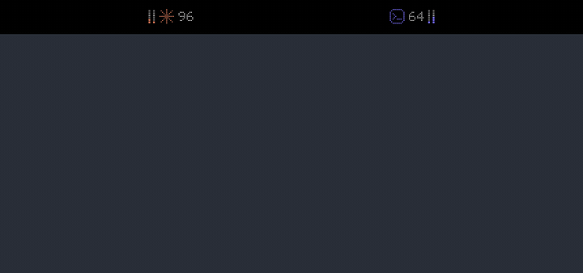
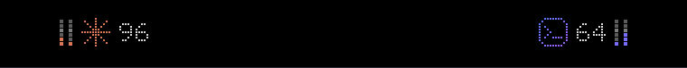
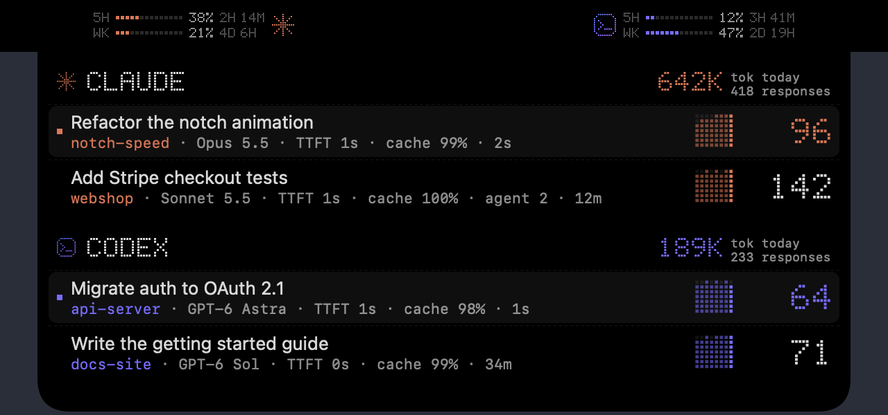
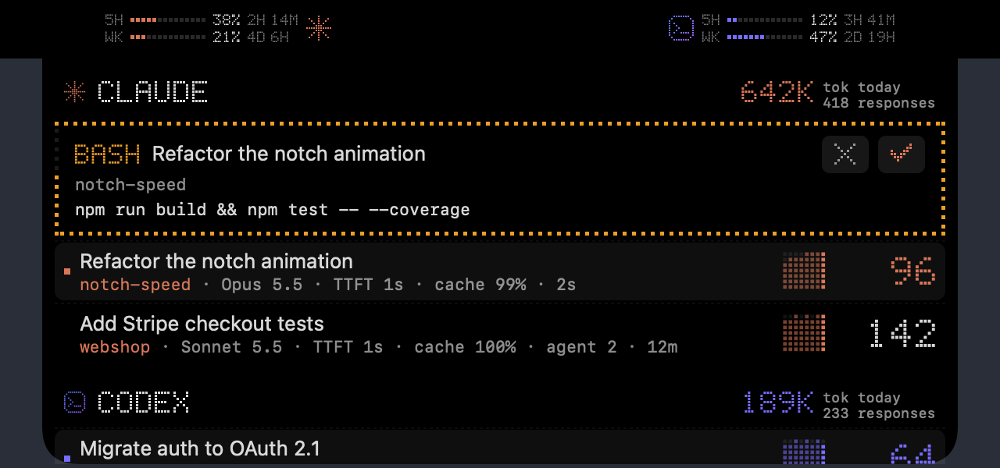
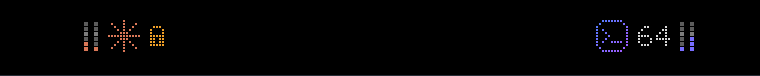

# notch-speed


**Your MacBook notch, turned into a live dashboard for Claude Code and Codex:** true generation speed, rate limits, today's output, and permission prompts you can approve without leaving what you're doing.



<sub>▶ [Full-quality video (MP4)](assets/expand.mp4) · all screenshots use the bundled demo data, see [Demo mode](#demo-mode)</sub>

> Fork of [JuDaXia/claude-speed](https://github.com/JuDaXia/claude-speed) (MIT). The measurement algorithm and [METRIC spec](METRIC.md) are unchanged; this fork adds the notch UI, permission prompts, rate limits and daily totals. Unofficial community tool, not affiliated with Anthropic or OpenAI.

## What you get

### Live speed in the notch ears



Each side of the notch is one provider: Claude on the left, Codex on the right. The LED logo animates while a model is generating, the number is the **true tokens per second** of the current response (first-token latency is fitted out, see [How it works](#how-it-works)), and the small dot columns next to the logo are your **5-hour and weekly rate limits**.

### Hover to open



Move the pointer onto the notch and it springs open:

- **Rate limits unroll from the ears** into LED rows: `5H ▪▪▪▪······ 38% 2H 14M` — usage and time to reset, for both providers.
- **Today at a glance**: output tokens produced today and the number of responses, per provider.
- **One row per active session** with chat title, project, model, first-token latency, prompt-cache hit rate, a speed sparkline and the current speed. Click a row to jump straight into that chat (Claude desktop app or Codex).

### Approve permission prompts from the notch



When Claude Code asks for permission (run a command, edit a file), the request appears in the notch with the tool, the chat, the project and the exact command. Click ✓ or ✕ and Claude carries on. Destructive commands (`rm`, `git push --force`, `sudo`, …) need a press-and-hold instead of a click.



With the notch closed, an amber lock in the ear (plus a count) tells you something is waiting.

The notch stays out of the way when it isn't needed:

- If the app hosting that session (Claude desktop, your terminal) is already in front, the prompt goes straight to the chat's own dialog.
- If nobody answers within 30 seconds, Claude Code falls back to its normal dialog and the notch keeps a reminder with an **open chat** button until the chat is answered.
- Only one-off allow/deny decisions are made here; "always allow" rules stay in Claude Code.

## Install

Requires a Mac with a notch (on other Macs the same data shows as menu bar items), Xcode Command Line Tools (`xcode-select --install`) and python3.

```bash
git clone https://github.com/sevq1993-cyber/notch-speed && cd notch-speed
./install.sh                # notch app, starts at login
./install.sh --statusline   # + Claude Code statusline
```

The app reads Claude Code and Codex transcripts locally. The only network call is a rate-limit lookup against Anthropic's usage endpoint (the same data `/usage` shows), made with Claude Code's own login at most every 5 minutes.

**Permission prompts** are opt-in. Add the hook to `~/.claude/settings.json`:

```json
{
  "hooks": {
    "PermissionRequest": [
      { "matcher": "*", "hooks": [ { "type": "command", "command": "python3 /path/to/notch-speed/permission-hook.py", "timeout": 45 } ] }
    ]
  }
}
```

`CLAUDE_SPEED_PERM_TIMEOUT` (seconds, default 30) sets how long the notch waits before handing the prompt back to Claude Code. When the app isn't running, the hook does nothing.

**Update:** `git pull && ./install.sh`. **Uninstall:** `./uninstall.sh`.

## Demo mode

Screenshots and recordings use made-up sessions so no real chat titles or projects leak:

```bash
launchctl bootout gui/$(id -u)/com.claude-speed.menubar        # stop the regular app
CLAUDE_SPEED_DEMO=$PWD/assets/demo.json ./ClaudeSpeed &         # run on demo data
launchctl bootstrap gui/$(id -u) ~/Library/LaunchAgents/com.claude-speed.menubar.plist  # back to normal
```

Edit [`assets/demo.json`](assets/demo.json) to stage your own scene; live rows jitter slightly on every refresh.

## Other platforms

The upstream menu bar, Windows tray, WSL and statusline modes are still here.

**Windows (tray app):** in PowerShell (5.1 or 7), with python 3 on PATH:

```powershell
git clone https://github.com/sevq1993-cyber/notch-speed; cd claude-speed
.\install.ps1                 # tray app + autostart shortcut (shell:startup)
.\install.ps1 -Statusline     # + wire the Claude Code statusline
```

A colored circle with the tok/s number appears in the tray (`⚪` idle). Hover for the summary, click for one line per session. `-Python <exe>` picks the interpreter, `-NoAutostart` skips the Startup shortcut, `.\uninstall.ps1` removes everything.

**Windows + WSL (one tray for both):** the tray cannot read WSL transcripts directly (`\\wsl$` is slow and unavailable on some kernels), so it asks the WSL copy to collect and merges the rows:

```powershell
# clone the repo inside WSL too (e.g. ~/projects/notch-speed), then:
.\install.ps1 -Remotes 'wsl.exe -e python3 /home/<you>/projects/claude-speed/collect.py --json'
```

`-Remotes` stores `CLAUDE_SPEED_REMOTES` (user env var, `;`-separated commands). Each command must print `collect.py --json`; remote rows show up as `wsl:project·model`. Remote sessions keep their own slope pool (no cross-host borrowing). A remote that fails or exceeds 8s is silently skipped.

**WSL / Linux (statusline only — no tray under WSLg):**

```bash
git clone https://github.com/sevq1993-cyber/notch-speed ~/projects/notch-speed
~/projects/notch-speed/install.sh --statusline   # replaces ~/.claude/settings.json statusLine (backup .bak)
```

**Embed into an existing statusline script** (keep your own layout; works on macOS/Linux/WSL/Windows git-bash):

```bash
# inside your statusline script, $input = the JSON Claude Code piped in
case "$OSTYPE" in msys*|cygwin*) py=python ;; *) py=python3 ;; esac   # Windows: python3 is the Store stub
seg=$(printf '%s' "$input" | CLAUDE_SPEED_SEP=" | " \
      CLAUDE_SPEED_PALETTE="ok=${green}|warn=${yellow}|bad=${red}|info=${cyan}|dim=${dim}|text=${white}|reset=${reset}" \
      "$py" ~/projects/notch-speed/statusline-speed.py --segment)
[ -n "$seg" ] && printf "\n%b" "$seg"      # its own line under your first line
```

`--segment` prints only the speed parts (`⚡71 tok/s 首字4.2s | 缓存98% | 最近1022tok·22s | 🤖2 Σ40tok/s | ⚠️1错`) — no model name or ctx%, and **nothing at all** when there is no data yet, so the host never gets an empty slot. `CLAUDE_SPEED_SEP` overrides the separator; `CLAUDE_SPEED_PALETTE` (`key=escape|key=escape`, keys `ok warn bad info dim text reset`) makes the segment use your script's own colors (truecolor sequences welcome, literal `\033` is fine when you print with `%b`), so the line matches the rest of your statusline.

**Statusline only, any platform:** add to `~/.claude/settings.json`:

```json
{ "statusLine": { "type": "command", "command": "/path/to/claude-speed/statusline-speed.py", "padding": 0 } }
```

**Statusline only, any platform:** add to `~/.claude/settings.json`:

```json
{ "statusLine": { "type": "command", "command": "/path/to/notch-speed/statusline-speed.py", "padding": 0 } }
```

## How it works

- Consecutive `assistant` records sharing one `message.id` in the transcript JSONL = one API response. Duration = last timestamp in the group − timestamp of the record preceding the group (≈ request send time), i.e. **including TTFT**. Token count = max `usage.output_tokens` in the group.
- Synthetic API-error records (`message.model == "<synthetic>"`) never form groups, but their timestamps still anchor the next group (a retry after an error is timed from the error, not the original request) and feed the ⚠️ indicators.
- **Per-model fitting**: only groups from the current model are fitted — mixing models mid-session skews the slope.
- **Outlier rejection**: groups with `duration/tokens > 0.5 s/tok` contain "user was typing" pauses and are dropped.
- **Sliding window**: fitting prefers the last 10 minutes of samples (server load drifts); the window doubles until the fit succeeds, and the effective span is labeled `·近N分`.
- **Two-stage fit**: with too few samples in one session, the slope (a model property) is borrowed from a cross-session pool; only the intercept (a session property) is fitted locally — new sessions show a speed after ~2 responses (`≈` marker).
- **Honest fallbacks**: when even that fails, long replies (≥300 tok) give a blended speed shown as a lower bound `≥N` (green only if the bound itself clears the green threshold); otherwise "insufficient samples". Large transcripts are tail-read (400 KB); malformed lines are skipped silently.
- **Background subagent monitoring**: research/Task agents write to `<session>/subagents/agent-*.jsonl` while the main transcript stays silent — a session's activity time is therefore `max(main transcript, newest subagent)`, so background work is never mistaken for idle. Agents with writes in the last 90s count as active; their combined output over the last 2 minutes gives the fleet burn rate (`🤖N Σtok/s`), and their response samples join the cross-session pool for two-stage fitting.
- **Codex CLI support** (menu bar only): Codex sessions live in `~/.codex/sessions/YYYY/MM/DD/rollout-*.jsonl`. Each API response streams content records and is closed by a `token_count` event carrying full usage. Group start = timestamp of the record preceding the first content record (includes TTFT, same semantics as Claude); group end = the **last content record**, not the `token_count` event — that fires after tool execution and would inflate generation time. Model comes from `turn_context`, project label from `session_meta.cwd`, cache hit from `cached_input_tokens/input_tokens`. Everything downstream (fitting, windows, display) is reused as-is. Sessions with stale content are excluded even if the file was recently touched.
- **Kimi Code support** (menu bar only — Kimi Code has no statusline hook): sessions live in `~/.kimi-code/sessions/<workDirKey>/<sessionId>/agents/main/wire.jsonl` (root relocatable via `KIMI_CODE_HOME`). One API response = an `llm.request` record paired with its closing `step.end` event, which carries full usage. Group start = the `llm.request` time (it *is* the request send time); group end = the `step.end` time; wire `time` fields are epoch-millisecond strings. A retry (new `llm.request` before any `step.end`) re-anchors to the retry, mirroring Claude's error-anchor rule. Usage maps 1:1 (`inputOther`/`inputCacheRead`/`inputCacheCreation`); model comes from `llm.request.model`; project label from `session_index.jsonl`'s `workDir`, falling back to the `workDirKey` slug. Subagents at `agents/agent-*/wire.jsonl` feed the same fleet monitoring (`🤖N Σtok/s`) and slope pool. Note: `wire.jsonl` is an undocumented internal format — the parser skips anything it doesn't recognize, and a future format change degrades display rather than crashing.
- **OpenCode Desktop support** (menu bar only — no statusline wiring): in OpenCode v1.18.15, Desktop and CLI share the XDG data database at `$XDG_DATA_HOME/opencode/opencode.db` (`~/.local/share/opencode/opencode.db` by default on macOS). claude-speed reads the SQLite database and its WAL without writing to either. Each completed assistant message is one response and `out = tokens.output + tokens.reasoning`. The generation boundary is the latest text/reasoning end or tool start (falling back to `time.completed` for an older shape); duration runs from `time.created` to that boundary, minus the **union** of earlier tool-state intervals. This excludes local `bash`/`task`/`question` execution without double-deducting overlapping tools. Input/cache usage maps from `tokens.input`, `tokens.cache.read` and `tokens.cache.write`; `providerID/modelID` is the model key; `session.directory` supplies the project label. Sessions with a `parent_id` are treated as background agents and feed fleet monitoring and the cross-session slope pool. The database and schema are undocumented internal implementation details: an unrecognized schema is skipped silently, degrading the display instead of crashing the collector.

## Operations

```bash
# Rebuild after editing main.swift
swiftc -O -o ClaudeSpeed main.swift

# Restart the menu bar app — use kickstart, NOT unload/load:
# from a non-GUI context (SSH, agents, background shells) unload/load starts
# the app without a WindowServer connection: process alive, no icon, dead timer.
launchctl kickstart -k gui/$(id -u)/com.claude-speed.menubar

# Test the collector manually
./collect.py               # merged view (incl. CLAUDE_SPEED_REMOTES)
./collect.py --no-remote   # this machine only
./collect.py --json        # what a remote hands to the tray

# Windows: restart the tray (install.ps1 is idempotent and does exactly this)
.\install.ps1 -NoAutostart
```

Tunables are constants at the top of both Python scripts (thresholds, windows, session count).

## Measurement standard

The displayed speed is an *estimate*, not an absolute reading, and its basis can
drift as the algorithm evolves — so the definition is pinned. [METRIC.md](METRIC.md)
is the versioned spec (currently v1.2): what "speed" means, the anchor rules, the
estimator, and every parameter. `tests/fixtures/*.jsonl` are frozen source
records (the physical standard); `tests/golden.json` is their certified reading.
Every CI run asserts the estimator still reproduces those readings (**drift** — a
code change that moves the number turns the suite red) *and* still recovers each
synthetic fixture's known ground truth (**calibration** — guards against a biased
recalibration). Changing the basis is deliberate: run `regen_golden.py`, review
the `golden.json` diff, bump the version, and document the shift.

## Development

```bash
python3 -m unittest discover -s tests -v
```

Tests cover the fitting math (known-truth recovery, outlier rejection, window
expansion), source adapters (including OpenCode SQLite/WAL parsing and tool-time
subtraction), end-to-end menu bar scenarios (waiting, errors, cold cache,
two-stage fit, background subagents and fleet burn proration), and a source-level
AST check enforcing that the shared algorithm stays byte-identical between
`collect.py` and `statusline-speed.py`. CI runs them on macOS, Linux and Windows plus a
`swiftc` smoke build.

## License

MIT, see [LICENSE](LICENSE). Original work © 2026 judaxia ([claude-speed](https://github.com/JuDaXia/claude-speed)); the notch UI, permission prompts, limits and daily totals were added in this fork.
